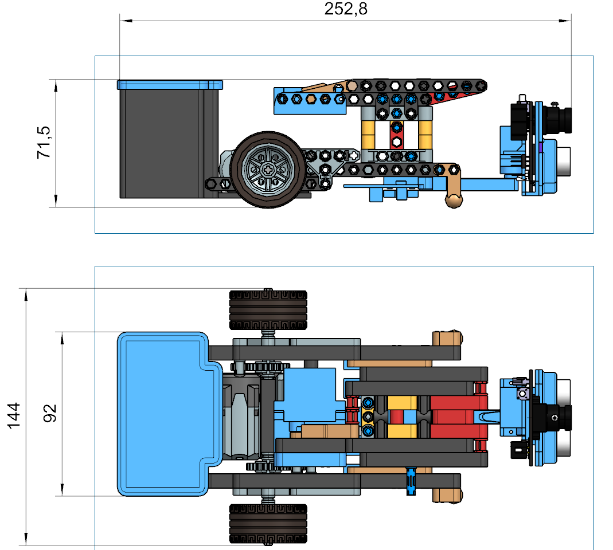
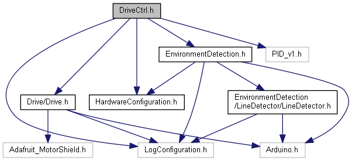
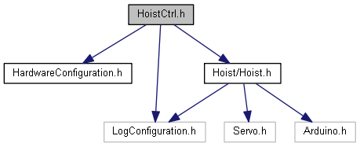
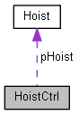

# SmartFactory_Vehicle-Basis

The [SmartFactory_Vehicle-Basis](https://github.com/LMazzole/SmartFactory_Vehicle-Basis) is an modular part of the *SmartFactory* project.  

[SmartFactory_Vehicle-Basis](https://github.com/LMazzole/SmartFactory_Vehicle-Basis) is a vehicle which is equipped with a drive, sensors (line-detection, ~~sonar and a camera~~) and a hoist. It consists of three modules:

* Environment-Detection
* Drive-Control
* Hoist-Control

 Multiple nested Finite State Machines (FSM) based on the pattern of the [ArdFSM](<https://github.com/LMazzole/ArdFSM>) are used to control the processes.

<!-- add Pagebreak: 

 -->

## Table of contents

<!-- TOC Generated with https://magnetikonline.github.io/markdown-toc-generate/ -->

- [The SmartFactory project](#the-smartfactory-project)
- [Tools and technologies](#tools-and-technologies)
	- [Doxygen](#doxygen)
	- [VSCode PlatformIO](#vscode-platformio)
	- [MQTT](#mqtt)
- [Documentation](#documentation)
	- [Hardware](#hardware)
	- [Software](#software)
		- [Dependency graph](#dependency-graph)
		- [Collaboration diagram](#collaboration-diagram)
		- [Important functions and files](#important-functions-and-files)
			- [HardwareConfiguration.h](#hardwareconfigurationh)
- [FAQ's](#faqs)
	- [I'd like to use this code in my project. What do I need to know?](#id-like-to-use-this-code-in-my-project-what-do-i-need-to-know)
- [ToDo's](#todos)
	- [Hardware](#hardware-1)
	- [Software](#software-1)
- [Contributors](#contributors)
- [Changelog](#changelog)
- [License](#license)

## The SmartFactory project

[SmartFactory_Vehicle-Basis](https://github.com/LMazzole/SmartFactory_Vehicle-Basis) is part of the *SmartFactory* project. It provides a library with basic vehicle functions.

Other *SmartFactory*-components are:
* [SmartFactory_MQTTCommunication](https://github.com/LMazzole/SmartFactory_MQTTCommunication)

A possible implementation of the *SmartFactory* project can be seen in the Sortic-Showcase:

The associated repositories are:  
  [SmartFactory-Sortic](https://github.com/LMazzole/SmartFactory-Sortic)  
  [SmartFactory_Box-Sortic](https://github.com/LMazzole/SmartFactory_Box-Sortic)  
  [SmartFactory_Vehicle-Sortic](https://github.com/LMazzole/SmartFactory_Vehicle-Sortic)  
  [SmartFactory_Vehicle-Basis](https://github.com/LMazzole/SmartFactory_Vehicle-Basis)  
  [SmartFactory_MQTTCommunication](https://github.com/LMazzole/SmartFactory_MQTTCommunication)  

## Tools and technologies

The source code is written in C++.
To achieve this project, the following listed tools and technologies were used.

### Doxygen
*Doxygen* is used for the documentation of the source-code.  
An intorduction to *Doxygen* and how to install it can be found in the [ArdFSM-Repo](https://github.com/LMazzole/ArdFSM#documentation-with-doxygen).  

### VSCode PlatformIO
The used  IDE is [VSCode](https://code.visualstudio.com/) with the [PlatformIO](https://platformio.org/platformio-ide)-extension.

### MQTT
For a description of the MQTT-Technologie take a look at the [MQTTCommunication-ReadMe](<https://github.com/LMazzole/SmartFactory_MQTTCommunication#mqtt>).   

# Documentation

## Hardware

[Source: FTS, BA FS18, Huber,Paly]

To build a *SmartVehicle* the following hardware is needed:

* 1x [Adafruit Feather M0 WiFi - ATSAMD21 + ATWINC1500](https://www.adafruit.com/product/3010) from Adafruit.
* 1x [DC Motor + Stepper FeatherWing Add-on ](<https://www.adafruit.com/product/2927>)
* 3x Battery with an JST 2.0 connection
* 1x [PixyCam](<https://pixycam.com/>)
* 1x Sonar - [HC-SR04](<https://www.play-zone.ch/de/ultraschall-distanzmesser-hc-sr04.html>)
* 5x IR Sensor - [IR-Sensor breakout-board](<https://www.play-zone.ch/de/reflektions-spur-sensor-breakout.html>)
* 1x Servo for Hoist - [Bluebird Midi-Servo BMS-390](<https://www.conrad.ch/de/p/bluebird-midi-servo-bms-390-dmh-digital-servo-getriebe-material-metall-stecksystem-jr-275487.html?insert=62>)
* 1x Servo for Cam and Sonar - [SG92R Adafruit 169](<https://www.conrad.ch/de/p/motor-micro-servo-sg92r-adafruit-169-1516595.html?insert=62>)
* 2x Drive Lego - [LEGO® Power Functions M-Motor](<https://shop.lego.com/de-CH/product/LEGO-Power-Functions-M-Motor-8883>)

For detailed building instructions please contact [Felix Nyffenegger](mailto:felix.nyffenegger@hsr.ch).

## Software

All functions and files are documented on the [GitHub-Page](<https://lmazzole.github.io/SmartFactory_Vehicle-Basis/>).  

It is important to mention that all functions are non-blocking and as short as possible so no other processes starves.

The Sonar and PixyCam functionalities are not implemented at the moment and are ~~crossed out~~.

The interface is documented in [DriveCtrl](<https://lmazzole.github.io/SmartFactory_Vehicle-Basis/class_drive_ctrl.html>), [EnvironmentDetection](<https://lmazzole.github.io/SmartFactory_Vehicle-Basis/class_environment_detection.html>) and [HoistCtrl](<https://lmazzole.github.io/SmartFactory_Vehicle-Basis/class_hoist_ctrl.html>).

### Dependency graph

      
    
    
<small>Click on the image to open doxygen-documentation.

Extern libraries:  

- [Adafruit Motor Shield V2 Library]()
- [Arduino PID](https://github.com/br3ttb/Arduino-PID-Library/)
- [Servo](<https://www.arduino.cc/en/Reference/Servo>)
- ~~[NewPing](<https://playground.arduino.cc/Code/NewPing/>)~~

### Collaboration diagram

    <a href=https://lmazzole.github.io/SmartFactory_Vehicle-Basis/class_drive_ctrl.html>
        
    
    
<small>Click on the image to open doxygen-documentation.

### Important functions and files

#### HardwareConfiguration.h

In [HardwareConfiguration.h](<https://lmazzole.github.io/SmartFactory_Vehicle-Basis/_hardware_configuration_8h.html>), all important settings for the vehicle-hardware are defined:  

- Setup for Drive
	- Speed, Motor-pins, PID-values
- Setup for the Linedetector
	- Pin-number
- Setup for Hoist
	- Pin-number, delay, minimal and maximal position 
- ~~Setup for Sonar~~
- ~~Setup for Vision~~

# FAQ's

#### I'd like to use this code in my project. What do I need to know?  
> All you need to do is adding the GitHub-Link to this repository under *lib_deps* in your platformio.ini file and you're set. All dependencies are downloaded automatically. The interface is documented in [DriveCtrl](<https://lmazzole.github.io/SmartFactory_Vehicle-Basis/class_drive_ctrl.html>), [EnvironmentDetection](<https://lmazzole.github.io/SmartFactory_Vehicle-Basis/class_environment_detection.html>) and [HoistCtrl](<https://lmazzole.github.io/SmartFactory_Vehicle-Basis/class_hoist_ctrl.html>).

# ToDo's

## Hardware

- [ ] The battery of the vehicle must be recharged manually. Inductive charging while waiting would be desirable.
- [ ] Sensors for line recognition have an unfavourable distance to the turning point. They should be placed closer to the vehicle axis to increase the accuracy of alignment.
- [ ] The line recognition functions unreliably. This may be caused by an imperfect white background and needs to be optimized.

## Software

The open ToDo's can be found in the documentation on the [GitHub-Page](https://lmazzole.github.io/SmartFactory_Box-Sortic/todo.html)

- [ ] Implement Sonar
- [ ] Implement Vision

# Contributors

- [Luca Mazzoleni](https://github.com/LMazzole)
- Glenn Patrick Huber
- Robert Paly

# Changelog

V 1.0	-	Release BA FS19	-	[Luca Mazzoleni](https://github.com/LMazzole)

# License

MIT License

